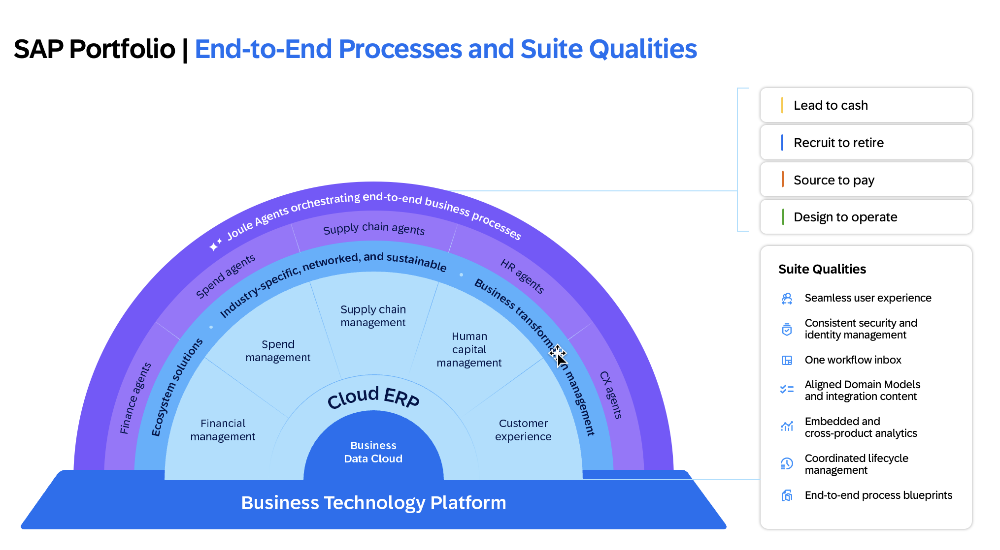
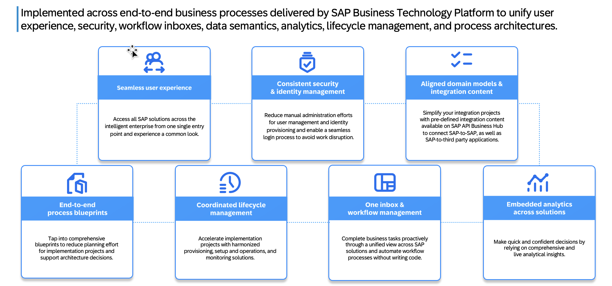

# SAP Integration Startegy

In today’s fast-moving and increasingly complex world, businesses face a constant challenge:
how to scale, innovate, and adapt – without being held back by disconnected systems,
data silos, and fragmented processes.

Today, SAP introduces the SAP Business Suite, the future of enterprise management –
a fully integrated, modular set of solutions designed to seamlessly connect and optimize
every function across your business. Fueled by the world’s most powerful business data
and meaningful AI, SAP Business Suite empowers companies to scale, innovate, and deliver
exceptional value – faster and easier than ever.

**Bringing together AI, data, and applications like never before.**

• Unrivaled AI – With SAP Business AI, collaborative agents – powered by Joule –
are deployed and orchestrated to enhance operations, generate real-time insights,
and optimize decision-making at scale – unlocking capabilities others can’t match.

• Unmatched Data – With SAP Business Data Cloud, your most valuable data is
transformed into a harmonized, semantically rich foundation that fuels unrivaled
AI-powered value – unlocking deeper insights and smarter decisions.

• Unparalleled Applications – With SAP’s business technology platform and suite of
mission-critical applications, every part of your business is seamlessly integrated –
delivering end-to-end transformational value across your processes.

**The pace of innovation won’t slow down** – neither should you. SAP Business Suite isn’t just
about keeping up; it’s about staying ahead – transforming complexity into opportunity and making
your business unstoppable. This is just the start of an exciting new chapter. As we gear up for Sapphire
2025, we’ll be sharing more on how SAP Business Suite helps organizations like yours thrive in a world
of rapid change. Stay tuned.

# Suite Qualities

Integrated enterprises offer a consistent experience throughout end-to-end key processes.
In 2020, SAP introduced distinct suite qualities that characterize integrated SAP applications.

## Seamless user experience

Improve the daily work experience of end users with a common look and feel for SAP solutions across end-to end
business processes. The SAP Start site serves as a central entry point for cloud solutions from SAP and utilizes SAP
Build Work Zone, delivering integrated search functionality and the SAP Task Center service integration for workflow
approvals, tasks, and recommended business insights content. The scope includes content from SAP S/4HANA Cloud, SAP SuccessFactors solutions, and SAP Fieldglass solutions.. 
Additional cloud solutions are on SAP’s roadmap. 
You can either use SAP Start “as is” and directly benefit from its features, choose to implement your own customized entry point scenario using SAP Build Work Zone.

## One workflow inbox

Complete business tasks proactively through a unified view of pending tasks across SAP solutions in both mobile and
desktop environments. The “one workflow inbox” capability is generally available as part of the SAP Task Center service, 
providing integration with major SAP solutions (for example, SAP S/4HANA Cloud, SAP S/4HANA, SAP SuccessFactors,
SAP Ariba, SAP Concur, and SAP Fieldglass) and third-party solutions through third-party system support. AI-generated
approval recommendations based on previously processed tasks now help you maximize the efficiency
of your workflows (currently available for the SAP Build Process Automation solution).

## End-to-end process blueprints

Reduce planning efforts for implementation projects
and support architecture decisions by leveraging
process blueprints following SAP Enterprise Architecture
Methodology. End-to-end process documentation is
linked to detailed, predefined integration in SAP Business
Accelerator Hub. Architecture documentation is available
for many solution scenarios (cloud and hybrid).
Furthermore, SAP Signavio and SAP LeanIX solutions
provide transparency into business processes and required
business capabilities. The necessary solution components
(applications) are also visible through their direct relations
and links to these business processes and capabilities.

## Coordinated lifecycle management

Benefit from a true software-as-a-service (SaaS)
experience for provisioning, integration, and configuration
by minimizing manual integration efforts through
automation and setups managed by SAP. Industry
cloud solutions, software for next-generation supplier
management, and the SAP Multi-Bank Connectivity
solution are already following this approach. Accelerate
implementation projects by providing holistic landscape
management, guided integration based on built-in defaults,
as well as compelling operations and monitoring solutions.
Guided implementation through a well-defined toolchain
is available for most scenarios for SAP S/4HANA Cloud
and select business processes across the SAP
solution portfolio.

## Consistent security and identity management

Manage the identities and access rights of your end users
centrally and consistently across SAP applications by
leveraging SAP Cloud Identity Services. At the same time,
your end users benefit from the availability of the single-
sign-on capability. In addition, the effort of IT security
administrators is significantly simplified, since the identity
distribution for the SAP solution portfolio can be controlled
through a central endpoint.

## Embedded and cross-product analytics

Make quick and confident decisions by relying on
comprehensive analytical insights across various SAP
solutions. Embedded analytics with SAP Analytics Cloud is
generally available for SAP S/4HANA; SAP SuccessFactors,
SAP Sales Cloud, SAP Service Cloud; SAP Business
Network; SAP Business Network for Logistics; SAP Digital
Manufacturing bundle for insights; and SAP Integrated
Business Planning for Supply Chain. Analytical insights
across multiple SAP and third-party applications can
best be realized using the SAP Datasphere solution that
enables data professionals to deliver smooth and
scalable access to mission-critical business data.

## Aligned Domain Models and integration content

Create connected experiences for your end-to-end business
processes by sharing semantically aligned domain models
across SAP applications with the help of SAP Master Data
Integration, by leveraging harmonized APIs for process
integration between SAP solutions and third-party solutions,
and by adopting an event-based integration strategy. Pre-
built integrations, APIs, data graphs, and business events
help to jump-start your integration projects.

[Source - SAP Integration Strategy Paper](https://www.sap.com/documents/2020/02/520ea921-847d-0010-87a3-c30de2ffd8ff.html)

**Continue with the [next excercise to learn more bout SAP BTP and SAP Build](/Excercises/ex2/README.md)**
