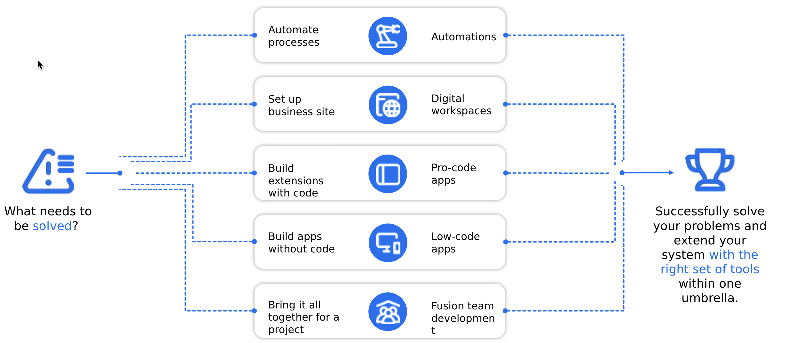
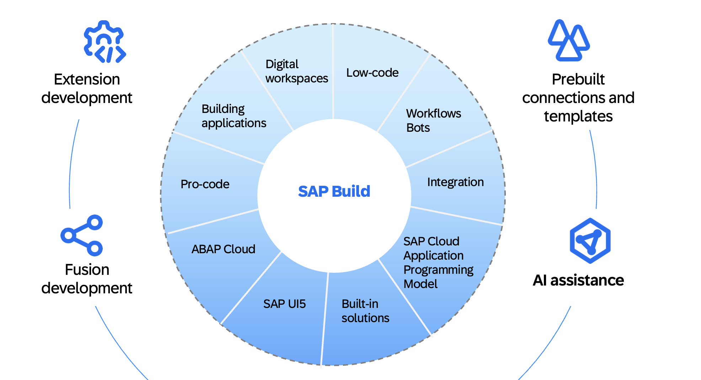
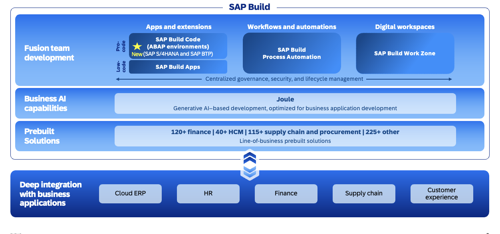

# Why SAP Build is key to your extensibility strategy

**You want to bring your unique value to the standard scope andextend with confidence.**

**You want tostart ahead and gain quick value early on across SAP systems with generative AI and ready-to-use extensions.**

**You need to break down organizational and technical silos and use your resources optimally to build together.**

One starting point, many possibilities to cover your needs with SAP Build

Use SAP Build for smooth extension development

With **SAP Build**, customers can accelerate their ERP modernization, foster innovation and automate processes, all within a single comprehensive suite of tools for extension development.

**SAP Build** provides you the flexibility to create and extend apps, automate processes and design digital workspaces with low-code, pro-code and generative AI tools. Its collaborative design allows diverse teams to build solutions faster using pre-built solutions, AI assistance, and seamless integration with SAP applications.

- **Fusion Development:** Built with collaboration in mind, SAP Build enables professionals, IT experts, and business users to work together for faster, more effective solution building.
Intelligent Copilot: Powered by Joule, a copilot leveraging industry data, process knowledge, and customer data to understand your business needs.
- **Pre-built Solutions:** Accelerate development with over 500 pre-built solutions for industry and lines of business. Both SAP and partners contribute, maintain and update content.
- **Seamless Integration:** Deeply integrated with SAP's business applications, Build offers quick access from within your applications, leveraging familiar identity, security, and APIs for enhanced simplicity and efficiency. An extensive library of 5,000+ connectors, integration flows and business events for SAP and non-SAP applications all available in the Business Accelerator Hub

