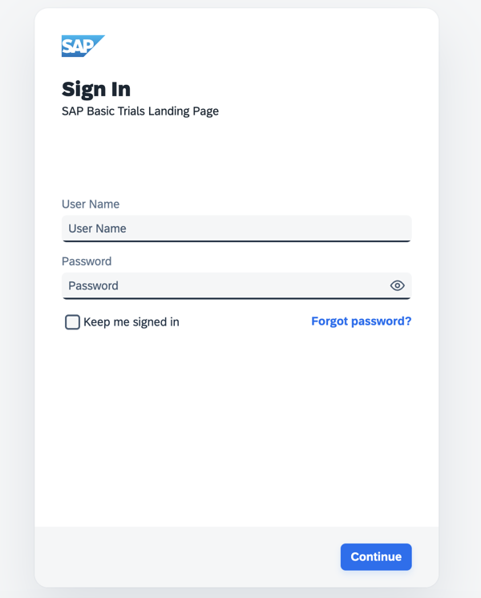
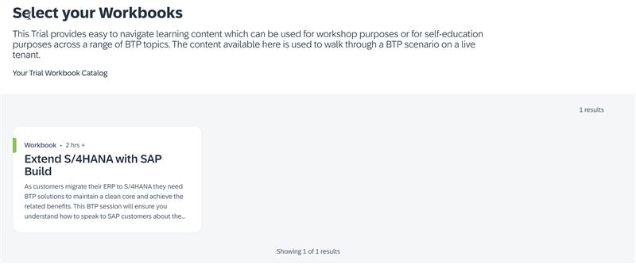

# BTP Summit Essen 2025 

## End-to-End Erweiterungslösungen mit SAP Build auf der BTP

## Get your Hand's Dirty - System access !

To get started, please enter the following [link](https://trials.cfapps.eu10-004.hana.ondemand.com/) on your local device

Alternatively, scan the QR code here:


- Long in with your credentials (which we shared with you during the session) and will have the following pattern:

```
Username: AC168453U##
Note: you will have been assigned a number from 02 - 40
Password: Obk0uS1Ot61!
```



- Once you are logged in, you will see the following screen:



**You can now follow all steps in the workbook to get your hands dirty with SAP Build**

## SAP Build HandsOn URL's

[SAP Build Lobby](https://sap-build-eu10-trial.eu10.build.cloud.sap/lobby)

[SAP Business Application Studio](https://sap-build-hana-cloud.eu10cf.applicationstudio.cloud.sap/)
